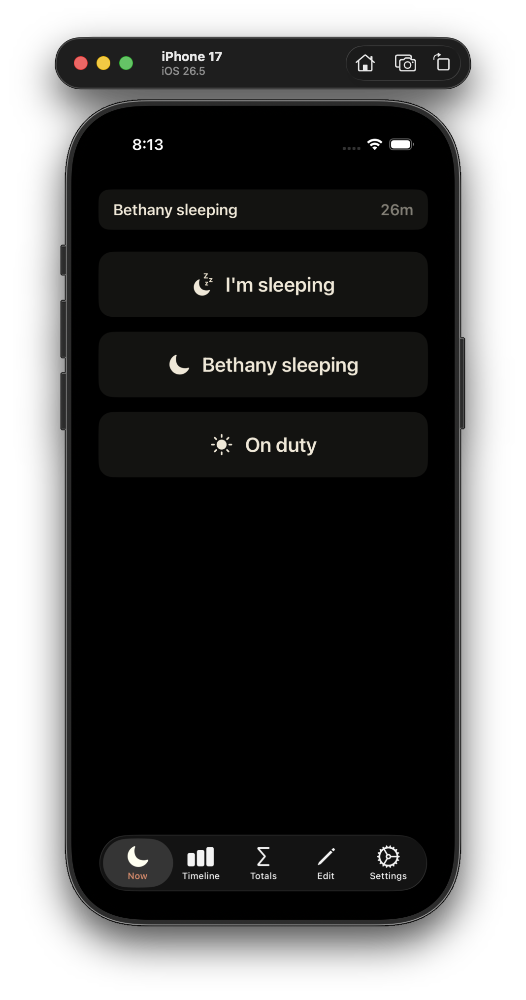
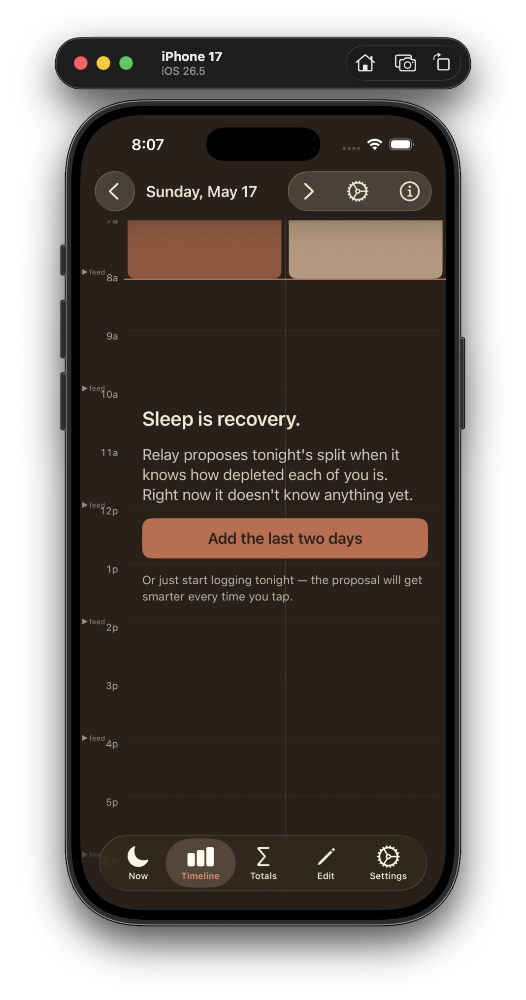
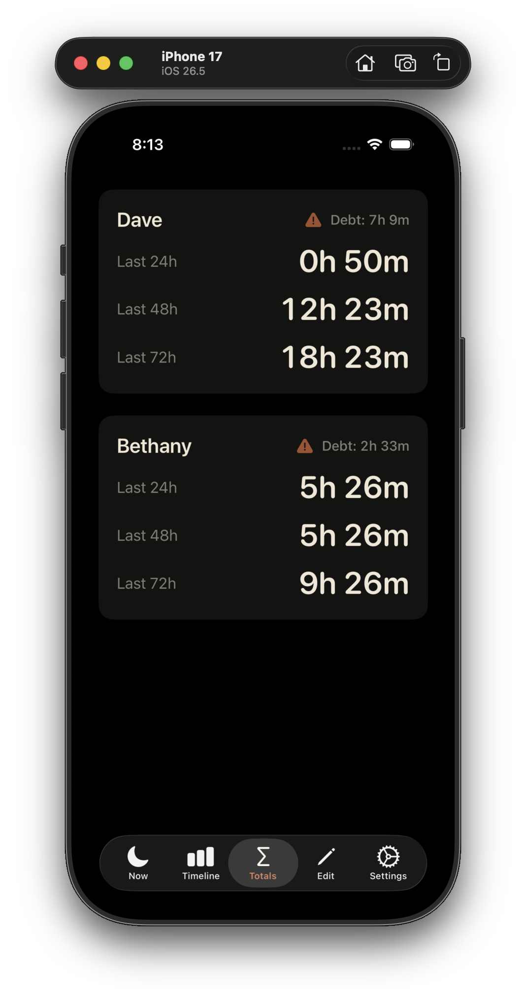
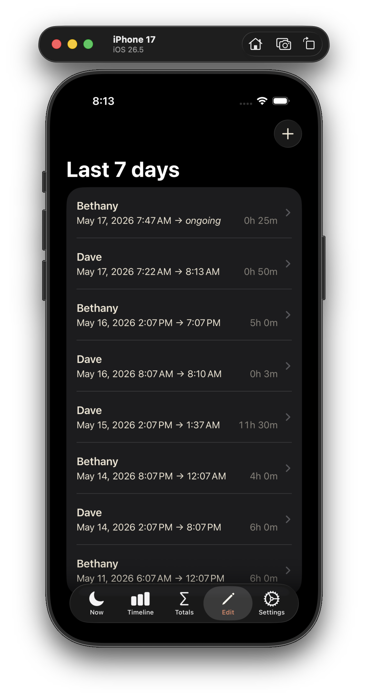
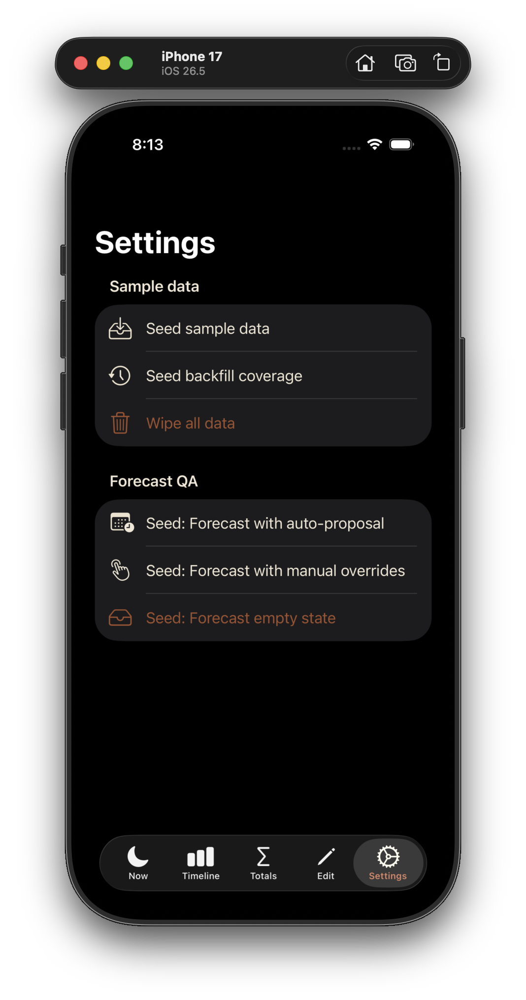

# Relay

> **A quiet sleep tracker for the newborn period. Two parents, two lanes, one screen. No streaks, no scoring, no notifications. Just the night you're in.**

Relay is an iOS app for two-parent households sharing overnight care during the first months after a newborn arrives. Tap once to start a sleep session. Tap again to end it. The math is honest — the deficit is the deficit.

[Get Relay on the App Store](#) <!-- TODO: replace with live App Store URL after approval -->

---

## Support & Contact

**Email:** [dpaola2@gmail.com](mailto:dpaola2@gmail.com)

For bug reports, please include:
- Your iPhone model and iOS version
- A description of what you did and what happened
- A screenshot if relevant

Replies usually within a day or two — this is a one-person project.

---

## What's on the screen

### Now — log a shift in one tap, half-conscious, in the dark

Two cards, one per parent. Tap **Start** when you go to bed, **Stop** when you wake up. Whichever session is open shows its running duration live. The whole app is designed to be operable one-handed in a dark room at 3am.

### Timeline — see the night you just had

A vertical day view with the hour rail down the left and two parallel lanes — one for each parent, color-coded. Sleep blocks are positioned by start time and sized by duration. Swipe left or right to navigate between days; the app keeps the last 7 days of history.

### Totals — how depleted is each of you, right now

Cumulative sleep over the last 24h and 48h, per person. A sleep-debt indicator surfaces whoever is more behind on rest.

### Edit — fix what you forgot to tap

A scrollable list of every session from the last 7 days. Tap a row to adjust its start/end times or delete it. Tap **+** to add a session you forgot to log in real time — including backfilling the first days of using the app.

### Settings — configure names

Edit the display names for both parents. Names propagate everywhere — the Timeline lane headers, the Totals tab, the home-screen widget.

### Home-screen widget

A small (`systemSmall`) widget shows sleep debt at a glance for both parents. Add it from the home-screen widget gallery — long-press an empty area, tap the **+** in the top corner, search for Relay.

---

## What's deliberately not in Relay

- **No streaks, badges, or scores.** Sleep isn't a game.
- **No coaching messages.** Relay shows you the data and gets out of the way.
- **No notifications or alarms.** The baby is already making noise.
- **No turn-taking math.** Relay tracks who slept, not who's "winning."
- **No baby tracking.** No feeds, diapers, or weight. Use a baby tracker (like Huckleberry) for that.
- **No social features, no leaderboards.**
- **No account, no sign-in.** Anonymous, local-device only.
- **No HealthKit or Apple Watch import.** Manual logging only — the friction is intentional.

---

## Philosophy — the seven Care Principles

Relay's design is grounded in seven beliefs about the postpartum period. They live in the algorithms and in a few quiet design moments (the onboarding screen, the empty states). They are the *why* underneath every feature.

1. **Sleep is recovery, not luxury.** Especially in the fourth trimester. Every hour matters.
2. **Plan when clear. Trust the plan at 3am.** Decisions made in extreme fatigue are systematically worse than decisions made when rested.
3. **Data over scorekeeping.** Both parents see the same numbers. Nobody is tracking the other.
4. **The longer block goes to whoever needs it more.** Splits are based on present sleep deficit — never on history of who has done more.
5. **The plan is a starting place. Deviation is expected.** Newborn sleep is chaos. The plan is a tool, not a verdict.
6. **One day at a time.** No streaks, no week views, no long-horizon goals. The fourth trimester is a season.
7. **The tool proposes. You decide.** Relay surfaces the data and gets out of the way; it doesn't coach.

---

## Privacy

Relay collects no data. None.

→ Read the full [Privacy Policy](./privacy.md) for the formal version.

- All sleep data is stored locally on your device using Apple's SwiftData framework.
- The app does not contact any server. There is no Relay backend.
- The app does not include any third-party analytics, advertising, or tracking SDKs.
- The app does not request any system permissions (no location, no contacts, no notifications).
- The app does not access HealthKit, Calendar, Photos, or any other system data.

The only thing that ever leaves your device is sleep data you optionally back up to **your own** iCloud account — and only if you turn that on in iOS Settings → iCloud → Apps using iCloud. Apple, not Relay, controls that backup. The Relay developer has no access to it.

---

## Frequently asked questions

### Why only two parents? Can I add a third caregiver?

Relay is built around the comparison of two adults sharing overnight care. Three lanes would change the layout, the math, and the mental model. Single-parent households and three-plus-caregiver households are real and worth serving, but they're not v1.

### Why no notifications or alarms?

Newborn parents already have a tiny human making all the noise required. Relay deliberately does nothing that would add to it.

### Why no Apple Watch or HealthKit?

Auto-detected sleep from a wearable is unreliable in the newborn period — short fragmented sessions, frequent waking, holding the baby. The "friction" of tapping is also the friction of *knowing* it happened, which matters more than the saved seconds. Future versions may revisit this.

### Why no streaks or scores?

See Care Principle 3. Sleep isn't a competition between two exhausted people.

### Does Relay work on iPad or Apple Watch?

iPhone only, for now. The interaction model is designed around one-handed use of a phone, which doesn't map cleanly to either of those.

### Does my data sync between phones?

iCloud backup of your local data is supported (via iOS's standard SwiftData + CloudKit integration). Multi-device sync — where both parents see the same data in real time on their own phones — is on the roadmap but not in v1.0. For now, one device per household holds the data.

### Can I export my data?

Not in v1.0. If you want this, email and tell me — it's a candidate for a future version.

### I lost my sleep data after reinstalling. Is it gone?

If you had iCloud backup enabled in iOS Settings, your data should restore when you re-install and sign in to the same iCloud account. If you did not have iCloud backup enabled, the data was stored only on the device and is no longer recoverable. Sorry.

### Why does my newborn ever sleep?

This question is outside the scope of Relay.

---

## Known limitations

- **Single device only.** v1.0 stores data on one device. If both parents want to view the data, they need to look at the same phone.
- **No data export.** v1.0 has no export feature.
- **English only.** v1.0 ships in English. Other languages are a future consideration.
- **iPhone only.** No iPad or Apple Watch app.

---

## Made by

Relay is a one-person project, built during paternity leave in 2026. Made with care for parents in the hardest months.

If Relay helped you, the best thank-you is to mention it to another set of newborn parents.

---

*Relay does not provide medical advice. Sleep deprivation in the postpartum period can have serious health consequences for both parents and infants. If you are struggling, please reach out to your healthcare provider.*
